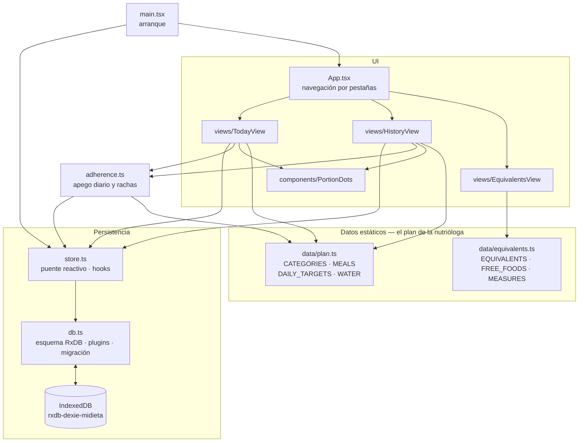
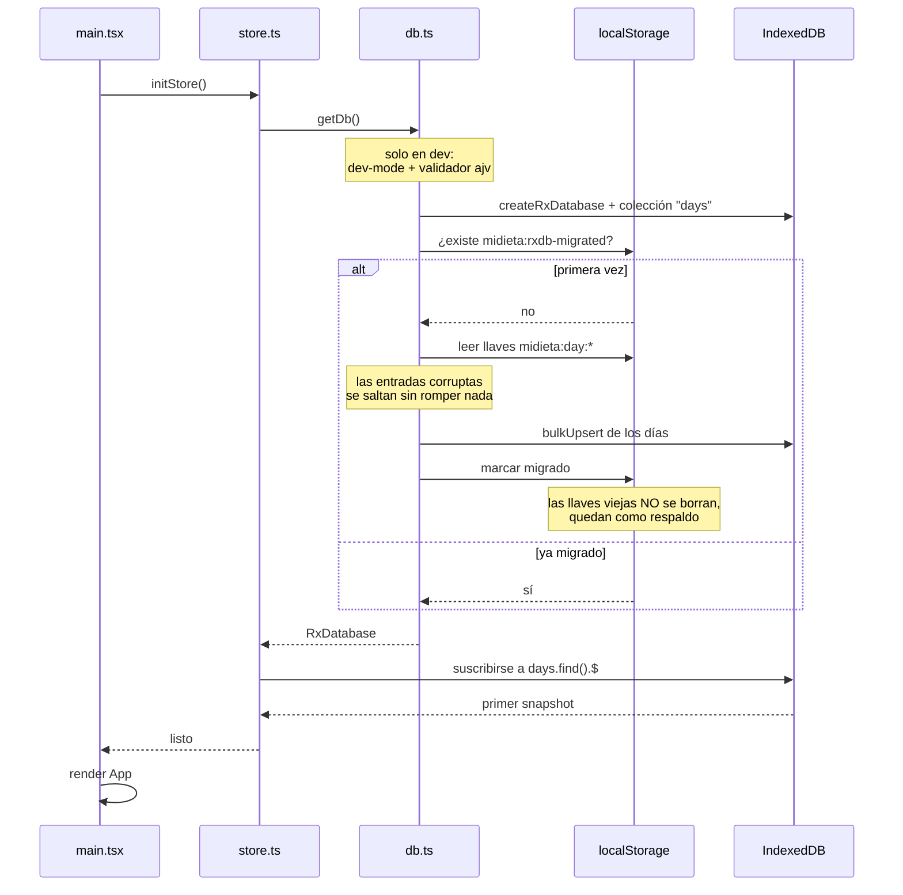
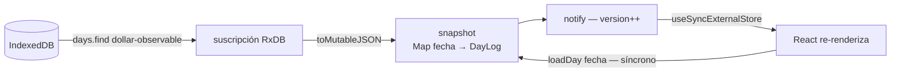
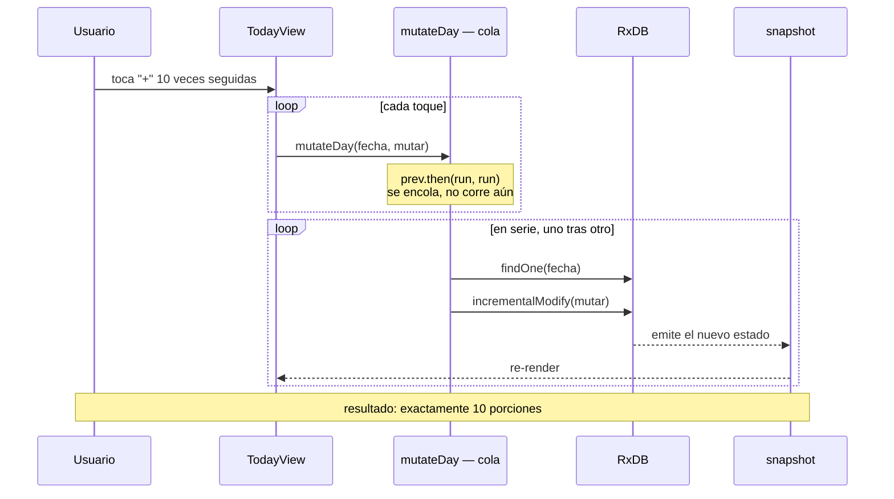
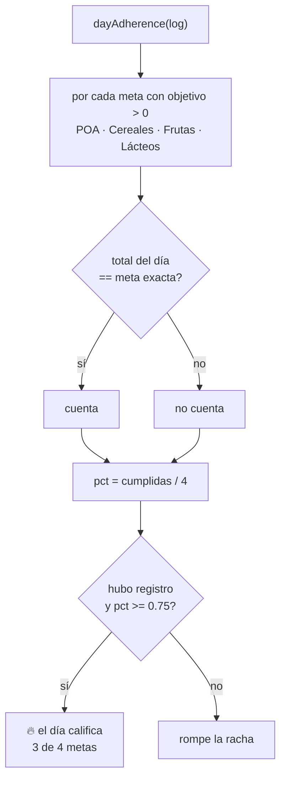
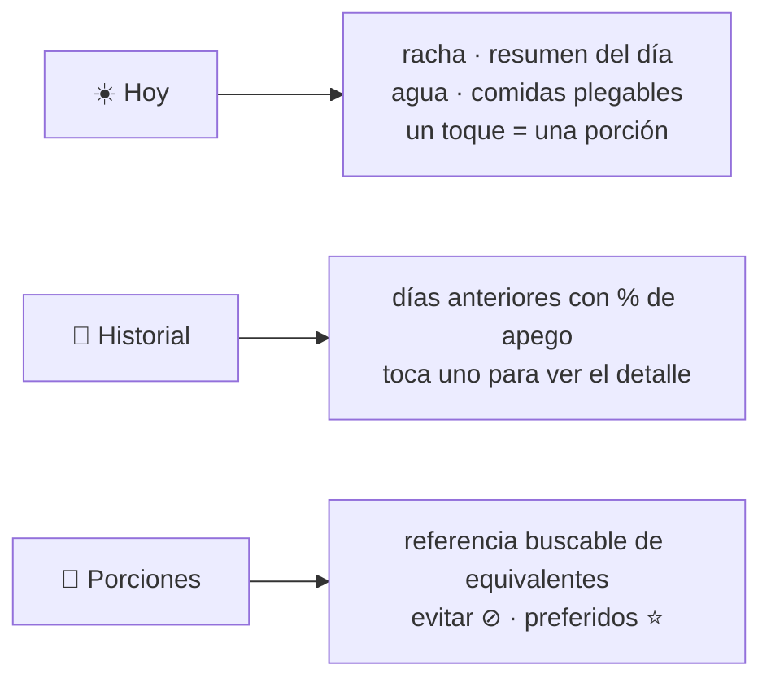
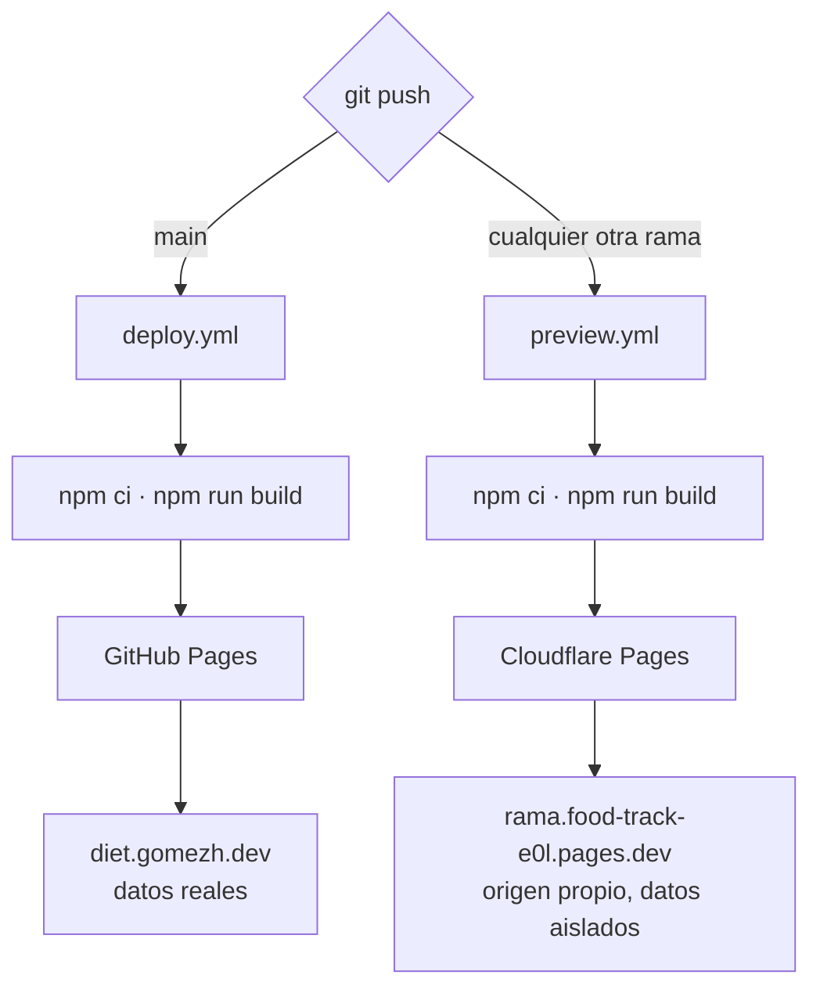

# Arquitectura de Mi Dieta

PWA móvil sin backend para registrar porciones de comida contra el plan de
equivalentes CLIDDI. Todo corre en el navegador; los datos nunca salen del
dispositivo.

**Stack:** Vite · React 18 · TypeScript · RxDB (storage Dexie sobre IndexedDB).

---

## 1. Mapa de módulos



El plan vive en datos estáticos, no en la base. La base guarda **solo lo que el
usuario registró**; las metas se comparan contra `plan.ts` al vuelo.

---

## 2. Modelo de datos

Un documento por día. La llave primaria es la fecha.

```ts
interface DayLog {
  date: string;    // "YYYY-MM-DD" — llave primaria (maxLength 10)
  meals: {         // JSON libre a propósito
    [comida: string]: { [categoría: string]: number };
  };
  waterMl: number;
}
```

`meals` se declara en el esquema como `{ type: "object" }` **sin propiedades**.
Es deliberado: cambiar las comidas o categorías en `plan.ts` no obliga a subir
la `version` del esquema ni a escribir migraciones de RxDB.

### El plan codificado

| Comida | Metas |
|---|---|
| 🍳 Desayuno | 2 POA · verduras libres |
| 🥛 Colación | 1 lácteo · 1 fruta |
| 🍽️ Comida | 6 POA · 2 cereales · 1 fruta · verduras libres |
| 🫖 Colación PM | — |
| 🌙 Cena | 4 POA · 1 cereal · verduras libres |

`DAILY_TARGETS` **se deriva sumando las comidas**, no se escribe a mano:
POA 12 · Cereales 3 · Frutas 2 · Lácteos 1 · Verduras libre.
Agua: meta 2.2–3.4 L, 1 vaso = 250 ml.

---

## 3. Arranque

RxDB abre de forma asíncrona, así que la app espera al primer snapshot antes de
renderizar. Ahí mismo ocurre, una sola vez, la importación de los datos que dejó
la versión anterior basada en `localStorage`.



Si IndexedDB no abre (modo privado, permisos, cuota) se muestra una pantalla de
error. **No** cae a storage en memoria: eso perdería registros en silencio.

---

## 4. Lectura — el puente reactivo

Las vistas y el cálculo de rachas leen los días de forma **síncrona**, aunque
RxDB sea asíncrono. El truco: `store.ts` mantiene un espejo en memoria
alimentado por la suscripción de RxDB.



Gracias a esto, `adherence.ts`, `TodayView` y `HistoryView` no saben que existe
RxDB: siguen llamando `loadDay()` y `listLoggedDates()` como siempre.

Los días son documentos pequeños y son pocos (uno por día), así que caben de
sobra en memoria.

**Efecto secundario gratis:** como la suscripción escucha a la base y RxDB
sincroniza instancias vía BroadcastChannel, dos pestañas abiertas se actualizan
solas entre sí.

---

## 5. Escritura — cola por fecha

Registrar es un toque, y los toques llegan rápido. Si las escrituras corrieran
en paralelo darían conflictos (409) o perderían incrementos: dos toques que leen
`0` y ambos escriben `1`.

`mutateDay()` encadena las escrituras **por fecha**, y cada una recibe el estado
más reciente del documento vía `incrementalModify`.



La función `mutar` siempre devuelve un objeto **nuevo** (spreads) y nunca muta el
argumento — en dev RxDB congela los documentos.

---

## 6. Apego y rachas

El apego premia dar en el blanco, no acumular: una meta cuenta solo si el total
del día es **exactamente** el objetivo. Las verduras quedan fuera del cálculo
porque son libres, así que son 4 metas: POA, cereales, frutas y lácteos.



La racha actual se cuenta hacia atrás desde hoy — o desde ayer si hoy todavía no
califica, para no castigar un día en curso. La mejor racha se calcula recorriendo
todos los días registrados. El umbral vive en `STREAK_THRESHOLD`.

---

## 7. Las tres pestañas



`TodayView` abre automáticamente la comida que corresponde a la hora del día
(según `fromHour` de cada comida). `PortionDots` dibuja los puntos: llenos
cuando se cumplió, marcados aparte cuando se pasó, y sin límite para verduras.

---

## 8. Deploy



El dominio custom se configura en los settings de Pages; con deploys vía Actions
no hace falta archivo `CNAME`. El service worker cachea el shell de la app para
que funcione sin conexión — al cambiar los assets hay que subir el número de
`CACHE` en `public/sw.js`.

Los previews por rama se configuran una sola vez; los pasos están en
[previews.md](previews.md).

---

## 9. Dónde tocar

| Cambio | Archivo |
|---|---|
| Cambió el plan de la nutrióloga | `src/data/plan.ts` |
| Cambió la lista de equivalentes | `src/data/equivalents.ts` |
| Umbral de la racha | `STREAK_THRESHOLD` en `src/adherence.ts` |
| Esquema o migraciones de la base | `src/db.ts` |
| Cómo React ve los datos | `src/store.ts` |

### Antes de hacer push

```sh
npm run build   # incluye tsc -b
npm run dev     # y probar en el navegador
```

`npm run build` **no** ejercita RxDB en dev-mode. Hay que abrir también
`npm run dev`, porque dev-mode aplica chequeos que producción no hace — por
ejemplo exige envolver el storage con un validador de esquema (error `DVM1`).
