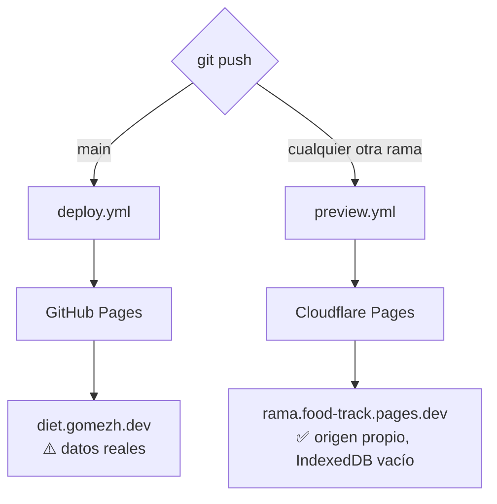
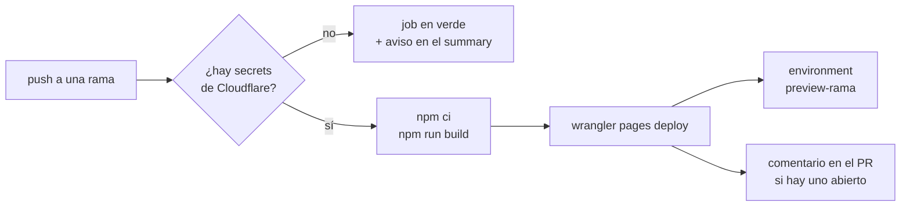

# Previews por rama

Cada push a una rama que no sea de producción publica una copia de la app en su
propia URL y la registra como **environment de GitHub**, con enlace clicable
desde la pestaña de Actions y desde el PR.

## Las dos rutas



Producción no cambia: sigue en GitHub Pages vía `deploy.yml`. El workflow de
previews la ignora explícitamente (`branches-ignore: [main, claude/…]`).

## Por qué Cloudflare y no una subcarpeta de Pages

**IndexedDB y localStorage se aíslan por origen, no por ruta.** Un preview en
`diet.gomezh.dev/preview/mi-rama/` compartiría la base `rxdb-dexie-midieta` con
la app real: probar un build tocaría los datos de dieta de verdad.

Cada rama en Cloudflare Pages recibe un subdominio propio
(`mi-rama.food-track.pages.dev`), que es **otro origen**. El preview arranca con
la base vacía y nada de lo que pruebes ahí llega a producción.

Como `*.pages.dev` está en la Public Suffix List, los previews tampoco comparten
almacenamiento entre ramas.

## Qué hace el workflow



Sin credenciales configuradas el workflow **se salta en verde** en vez de fallar
en rojo, y no crea un environment vacío.

Cada rama produce dos URLs:

| URL | Qué es |
|---|---|
| `https://<rama>.food-track.pages.dev` | Estable: siempre apunta al último build de esa rama |
| `https://<hash>.food-track.pages.dev` | Inmutable: ese build concreto, útil para comparar |

Cloudflare normaliza el nombre de la rama para el subdominio (minúsculas, y todo
lo que no sea alfanumérico pasa a `-`).

## Configuración inicial

Se hace **una sola vez**. Requiere una cuenta de Cloudflare (el plan gratuito
alcanza de sobra).

### 1. Crear el proyecto de Pages

```sh
npx wrangler login
npx wrangler pages project create food-track --production-branch=main
```

`--production-branch=main` importa: como el workflow nunca despliega `main` a
Cloudflare, **todo lo que publique será un preview**, nunca la producción de
Cloudflare.

Si le pones otro nombre al proyecto, regístralo:

```sh
gh variable set CLOUDFLARE_PROJECT_NAME --body "otro-nombre"
```

### 2. Crear el API token

En <https://dash.cloudflare.com/profile/api-tokens>:

1. **Create Token**
2. Hasta abajo, en **Custom token** → **Get started** (no hay plantilla para
   Pages; hay que armarlo a mano)
3. Ponle nombre, por ejemplo `food-track previews`
4. En **Permissions** elige exactamente:

   | | | |
   |---|---|---|
   | Account | Cloudflare Pages | Edit |

5. **Continue to summary** → **Create Token**

El token **solo se muestra una vez**; cópialo antes de cerrar.

Ese permiso es el único que hace falta para `wrangler pages deploy`, siempre que
el Account ID se pase explícitamente — que es justo lo que hace el workflow con
`accountId`. Por eso el token no necesita permisos de lectura de usuario.

### 2b. Encontrar el Account ID

Cualquiera de estas tres:

- `npx wrangler whoami`
- La URL del dashboard: `dash.cloudflare.com/<ACCOUNT_ID>/…`
- Dashboard → tu dominio → **Overview**, en la barra derecha bajo **API**

### 3. Guardar los secrets en el repo

```sh
gh secret set CLOUDFLARE_API_TOKEN
gh secret set CLOUDFLARE_ACCOUNT_ID
```

Listo. El siguiente push a cualquier rama genera su preview.

## Mantenimiento

Ni los alias de Cloudflare ni los environments de GitHub se borran solos al
borrar una rama. Para limpiar de vez en cuando:

```sh
# Ver los previews publicados
npx wrangler pages deployment list --project-name=food-track

# Borrar un environment viejo de GitHub
gh api -X DELETE repos/gomezhyuuga/food-track/environments/preview-mi-rama
```

## Probar el preview

Como el preview vive en otro origen, empieza **sin datos**. Para ejercitar la
importación desde `localStorage` que corre al arrancar (ver
[arquitectura.md](arquitectura.md#3-arranque)), siembra llaves `midieta:day:*` a
mano desde la consola del navegador y recarga.
