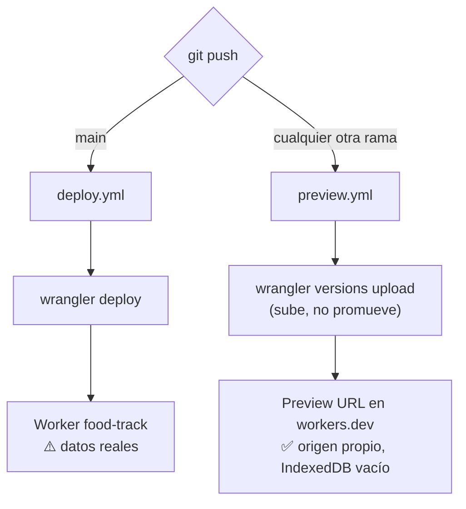
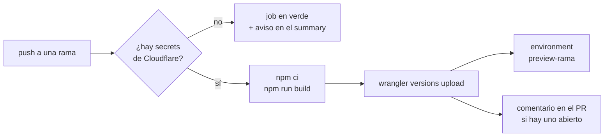

# Previews por rama

Cada push a una rama que no sea de producción publica una copia de la app en su
propia URL y la registra como **environment de GitHub**, con enlace clicable
desde la pestaña de Actions y desde el PR.

## Las dos rutas



Producción solo cambia con un push a `main`. El workflow de previews la ignora
explícitamente (`branches-ignore: [main]`) y además usa `versions upload`, que
**sube una versión sin promoverla**: aunque se ejecutara sobre `main`, no
reemplazaría lo que sirve producción.

## Por qué una URL aparte y no una subcarpeta

**IndexedDB y localStorage se aíslan por origen, no por ruta.** Un preview en
`diet.gomezh.dev/preview/mi-rama/` compartiría la base `rxdb-dexie-midieta` con
la app real: probar un build tocaría los datos de dieta de verdad.

Cada versión del Worker recibe su propia Preview URL en `workers.dev`, que es
**otro origen**. El preview arranca con la base vacía y nada de lo que pruebes
ahí llega a producción.

Como `*.workers.dev` está en la Public Suffix List, los previews tampoco
comparten almacenamiento entre sí.

## Qué hace el workflow



Sin credenciales configuradas el workflow **se salta en verde** en vez de fallar
en rojo, y no crea un environment vacío.

Cada push produce una **Preview URL** propia:

| URL | Qué es |
|---|---|
| `https://<version>-food-track.gomezhyuuga.workers.dev` | Esa versión concreta, inmutable |

A diferencia de Pages, no hay alias estable por rama: cada versión tiene su URL.
A cambio, cada una es reproducible y comparable, y ninguna puede reemplazar
producción por accidente — `versions upload` sube sin promover.

La URL queda registrada como environment de GitHub (`preview-<rama>`) y, si hay
un PR abierto, en un comentario que se reescribe en cada push.

## Configuración inicial

> Los secrets `CLOUDFLARE_API_TOKEN` y `CLOUDFLARE_ACCOUNT_ID` ya están
> guardados en el repo desde la etapa de Cloudflare Pages y **siguen sirviendo**.
> Lo que cambia es el destino: en vez de un proyecto de Pages, ahora se sube una
> versión del Worker.

Se hace **una sola vez**. Requiere una cuenta de Cloudflare (el plan gratuito
alcanza de sobra).

### 1. Habilitar el subdominio de workers.dev

Las Preview URLs cuelgan del subdominio `workers.dev` de la cuenta. Se activa
una sola vez desde el panel (**Workers & Pages → Domains**) o queda listo con el
primer `wrangler deploy`. En `wrangler.jsonc` ya está `"workers_dev": true`.

El nombre del Worker (`food-track`) sale de `wrangler.jsonc`; no hace falta
registrar ninguna variable extra en el repo.

### 2. Crear el API token

Cloudflare tiene tres credenciales distintas, y el prefijo las delata:

| Prefijo | Qué es | ¿Sirve aquí? |
|---|---|---|
| `cfat_` | **Account API token** — pertenece a la cuenta, no a una persona | ✅ el mejor para CI |
| `cfut_` | **User API token** — atado a tu usuario | ✅ funciona |
| `cfk_` | **Global API Key** — llave legacy con acceso total | ❌ usa otro esquema de auth |

El formato es el prefijo seguido de 40 caracteres y un checksum.

Para CI conviene el **account-owned** (`cfat_`): actúa como service principal,
así que el deploy no se rompe si la persona que creó el token pierde acceso a la
cuenta. Pages está en su matriz de compatibilidad. El de usuario (`cfut_`)
también funciona; es solo más frágil a largo plazo.

En <https://dash.cloudflare.com/profile/api-tokens>:

1. **Create Token**
2. Hasta abajo, en **Custom token** → **Get started** (no hay plantilla para
   Pages; hay que armarlo a mano)
3. Ponle nombre, por ejemplo `food-track previews`
4. En **Permissions** elige exactamente:

   | | | |
   |---|---|---|
   | Account | Cloudflare Pages | Edit |

5. En **Account Resources**, elige la cuenta cuyo ID vas a guardar como
   `CLOUDFLARE_ACCOUNT_ID`. Si no coinciden, el deploy falla con
   `Authentication error [code: 10000]`.
6. **Continue to summary** → **Create Token**

El token **solo se muestra una vez**; cópialo antes de cerrar.

Con Workers el permiso que hace falta es **Account → Workers Scripts → Edit**
(el de Pages ya no aplica). Sigue bastando con eso mientras el Account ID se
pase explícitamente — que es justo lo que hace el workflow con `accountId`. Por
eso el token no necesita permisos de lectura de usuario.

Si el token existente solo tenía el permiso de Pages, hay que editarlo o crear
uno nuevo: el `deploy` fallará con un error de autorización.

Para comprobar un token sin desplegar nada:

```sh
curl "https://api.cloudflare.com/client/v4/user/tokens/verify" \
  --header "Authorization: Bearer $CF_TOKEN"
```

Ojo con un detalle confuso: la respuesta **exitosa** trae `"code": 10000` con el
mensaje `"This API Token is valid and active"` — el mismo número que el error de
autenticación. Lo que importa es si aparece en `messages` (con `"success": true`)
o en `errors`.

### 2b. Encontrar el Account ID

Cualquiera de estas tres:

- `npx wrangler whoami`
- La URL del dashboard: `dash.cloudflare.com/<ACCOUNT_ID>/…`
- Dashboard → tu dominio → **Overview**, en la barra derecha bajo **API**

### 3. Guardar los secrets en el repo

```sh
gh secret set CLOUDFLARE_API_TOKEN
gh secret set CLOUDFLARE_ACCOUNT_ID
```

Listo. El siguiente push a cualquier rama genera su preview.

## Mantenimiento

Ni los alias de Cloudflare ni los environments de GitHub se borran solos al
borrar una rama. Para limpiar de vez en cuando:

```sh
# Ver las versiones subidas
npx wrangler versions list

# Ver qué versión sirve producción ahora mismo
npx wrangler deployments list

# Borrar un environment viejo de GitHub
gh api -X DELETE repos/gomezhyuuga/food-track/environments/preview-mi-rama
```

## Probar el preview

Como el preview vive en otro origen, empieza **sin datos**. Para ejercitar la
importación desde `localStorage` que corre al arrancar (ver
[arquitectura.md](arquitectura.md#3-arranque)), siembra llaves `midieta:day:*` a
mano desde la consola del navegador y recarga.
